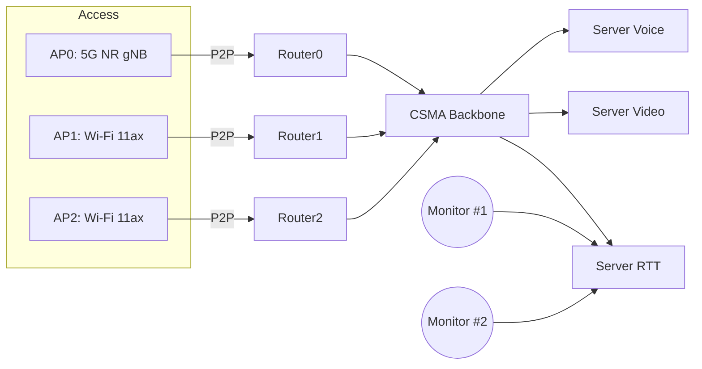

# 研究

## はじめに

このリポジトリは、ヘテロジニアスな無線アクセス環境での AP 選択アルゴリズム（Random / Greedy / Hungarian）の比較実験を ns-3 (3.44) 上で再現するためのプロジェクトです。AP0 を 5G NR gNB、AP1，2 を Wi‑Fi 802.11ax として構成して、端末群の接続戦略が遅延やトラフィックに与える影響を評価する想定しています。

- 目的: AP 選択手法の比較（遅延/経路の安定性）
- シナリオ: AP0=NR、AP1，2=Wi‑Fi、CSMA バックボーンに各ルータとサーバ群
- 出力: 端末満足度の調和平均（アルゴリズム別



## インストール

最短で動かすための前提（WSL2/Ubuntu を想定）：

- コンパイラ: gcc/g++ 10 以上（C++17）
- CMake: 3.13 以上
- Python: 3.8 以上

依存関係（最小セット）

```bash
sudo apt update
sudo apt install -y build-essential cmake gcc g++ pkg-config python3 python3-pip \
  libsqlite3-dev libeigen3-dev libgsl-dev libxml2-dev libgtk-3-dev
```

### contrib/nrモジュールの設定
依存パッケージ
```
sudo apt-get update
sudo apt-get install -y libc6-dev sqlite sqlite3 libsqlite3-dev libeigen3-dev
```

クローン
```
git clone https://github.com/Sota-Okochi/ns-3.44.git
```


### 実行

1) CMake 設定
```
./ns3 configure --enable-examples
```

2) ビルド
```
./ns3 build
```

3) 実行
```
./ns3 run master -- --nth=3
```

### ディレクトリ構造

- master/: 実験用メインプログラム
  - main.cc: 引数処理と起動
  - NetSim.cc/h: トポロジ構築・アプリ設定・ルーティング
- data/: 入力データ（上記ファイルを配置）
- OUTPUT/: 実行時出力（RTT/PCAP など）
- src/: ns-3 本体モジュール
- contrib/: 外部モジュール


### 実験環境

- OS: Ubuntu 22.04 (WSL2)
- CPU: Intel Core Ultra 7 265KF
- GPU: NVIDIA Geforce RTX 5070
- Compiler: GCC 12.3.0
- CMake: 3.22.1
- ns-3: 3.44
