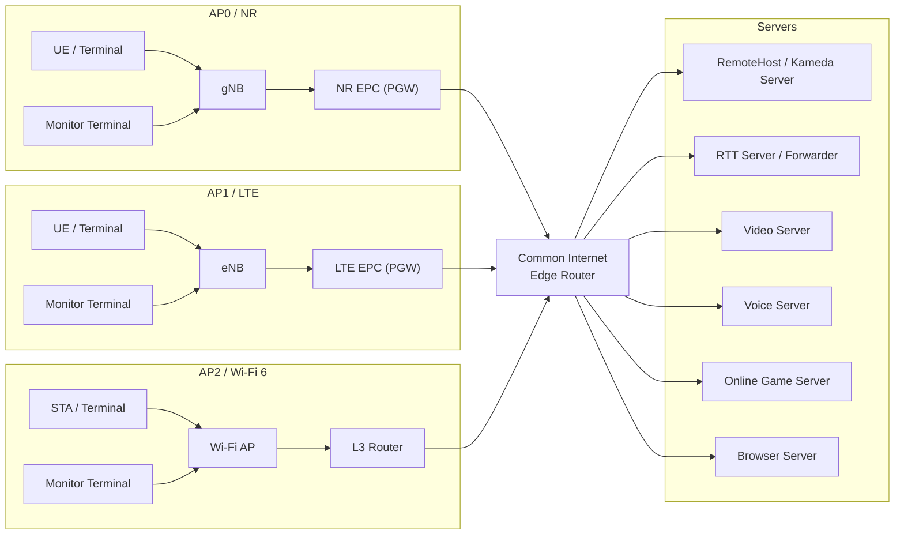

# 修士研究

## はじめに

このリポジトリは，ns-3上でヘテロジニアス無線ネットワーク環境を再現し，動的割り当て手法の有効性を検証するプロジェクトです．

- 目的: 動的割り当て手法の検証
- シナリオ: AP0が5G基地局，AP1,2はWi-Fi基地局，端末数は100台以上
- 出力: スループットとラウンドトリップタイムを元に定義された端末満足度の調和平均（全体最適化の客観的評価）

## 目次
- [ネットワークアーキテクチャ](#ネットワークアーキテクチャ)
- [環境設定](#環境設定)
- [実行](#実行)
- [ディレクトリ構造](#ディレクトリ構造)
- [進捗状況](#進捗状況)
- [実験環境](#実験環境)

## ネットワークアーキテクチャ


```mermaid
flowchart LR
    %% --- Groups ---
    subgraph GNR["AP0 / NR"]
        NRUE["UE / Terminal"]
        NRMON["Monitor Terminal"]
        gNB["gNB"]
        NREPC["NR EPC (PGW)"]
        NRUE --> gNB
        NRMON --> gNB
        gNB --> NREPC
    end

    subgraph GLTE["AP1 / LTE"]
        LTEUE["UE / Terminal"]
        LTEMON["Monitor Terminal"]
        eNB["eNB"]
        LTEEPC["LTE EPC (PGW)"]
        LTEUE --> eNB
        LTEMON --> eNB
        eNB --> LTEEPC
    end

    subgraph GWiFi["AP2 / Wi-Fi 6"]
        STA["STA / Terminal"]
        WIFIMON["Monitor Terminal"]
        AP["Wi-Fi AP"]
        L3R["L3 Router"]
        STA --> AP
        WIFIMON --> AP
        AP --> L3R
    end

    subgraph Servers["Servers"]
        RH["RemoteHost / Kameda Server"]
        RTT["RTT Server / Forwarder"]
        VID["Video Server"]
        VOI["Voice Server"]
        GAM["Online Game Server"]
        BRW["Browser Server"]
    end

    %% --- Core Edge ---
    CER["Common Internet<br/>Edge Router"]
    NREPC --> CER
    LTEEPC --> CER
    L3R --> CER

    %% --- Fan-out to servers ---
    CER --> RH
    CER --> RTT
    CER --> VID
    CER --> VOI
    CER --> GAM
    CER --> BRW
```
### 各ノードの概要
| 種別 | 名称 | 役割 | 主な接続先 |
|---|---|---|---|
| NR | UE / Terminal | AP0 配下の端末 | gNB |
| NR | Monitor Terminal | AP0 の RTT/TP を測定する監視端末 | gNB / RTT Server / RemoteHost |
| NR | gNB | AP0 に相当する NR 基地局 | UE / Monitor Terminal / NR EPC |
| NR | NR EPC (PGW) | NR コアネットワーク | gNB / CER |
| LTE | UE / Terminal | AP1 配下の端末 | eNB |
| LTE | Monitor Terminal | AP1 の RTT/TP を測定する監視端末 | eNB / RTT Server / RemoteHost |
| LTE | eNB | AP1 に相当する LTE 基地局 | UE / Monitor Terminal / LTE EPC |
| LTE | LTE EPC (PGW) | LTE コアネットワーク | eNB / CER |
| Wi-Fi | STA / Terminal | AP2 以降の Wi-Fi 接続端末 | Wi-Fi AP |
| Wi-Fi | Monitor Terminal | Wi-Fi AP の RTT/TP を測定する監視端末 | Wi-Fi AP / RTT Server / RemoteHost |
| Wi-Fi | Wi-Fi AP | AP2 以降に相当する Wi-Fi 6 AP | STA / Monitor Terminal / L3 Router |
| Wi-Fi | L3 Router | Wi-Fi AP と CER を接続するルータ | Wi-Fi AP / CER |
| コア | CER | 共通エッジルータ | NR EPC / LTE EPC / L3 Router / 各サーバ |
| サーバ | RemoteHost / Kameda Server | AP 選択，端末満足度計算，割り当て結果生成 | CER |
| サーバ | RTT Server / Forwarder | 監視端末の RTT 測定結果を RemoteHost へ転送 | CER |
| サーバ | Video/Voice/Online Game/Browser | 各アプリケーションのトラフィック送受信 | CER |


### ノード間接続
- UE→gNB, STA→AP: Wireless
- gNB → EPC(UPF) → CER : PointToPoint
- AP1 → L3R1[L3 Router1] → CER : PointToPoint 
- AP2 → L3R2[L3 Router2] → CER : PointToPoint 
- CER ↔ servers : PointToPoint

## 環境設定
- LinuxベースのOS環境でプロジェクトを実行することができます．
### システムのアップデート
```
sudo apt update && sudo apt upgrade -y
```
### 依存ライブラリ設定
```
sudo apt install g++ python3 cmake ninja-build git gir1.2-goocanvas-2.0 python3-gi python3-gi-cairo python3-pygraphviz gir1.2-gtk-3.0 ipython3 tcpdump wireshark sqlite3 libsqlite3-dev qtbase5-dev qtchooser qt5-qmake qtbase5-dev-tools openmpi-bin openmpi-common openmpi-doc libopenmpi-dev doxygen graphviz imagemagick python3-sphinx dia imagemagick texlive dvipng latexmk texlive-extra-utils texlive-latex-extra texlive-font-utils libeigen3-dev gsl-bin libgsl-dev libgslcblas0 libxml2 libxml2-dev libgtk-3-dev lxc-utils lxc-templates vtun uml-utilities ebtables bridge-utils libxml2 libxml2-dev libboost-all-dev ccache python3-full python3-pip
```
- 参考URL：https://www.nsnam.com/2025/03/blog-post.html

### インストール
```
git clone https://github.com/Sota-Okochi/ns-3.44.git
```

## 実行

### Pythonバインディングのビルドを有効化
```
cd ~/ns-3.44
./ns3 configure --enable-examples
```
- `./ns3 configure`でも有効化できますが，サンプルコードを実行することができません．
### ビルド  
```
./ns3 build
```

### プロジェクトの実行  
```
./ns3 run master -- --nth=3
```
- 引数が`--nth=4`の場合，端末の初期APとアプリ番号はランダムに設定されます（それ以外は同じです）．

### 予備コマンド
#### クリーン
```
./ns3 clean
```
- このコマンドを実行すると，CMake設定とビルドによって生成された成果物が削除されます．
- 再度，[ここから](#pythonバインディングのビルドを有効化)実行してください．

## ディレクトリ構造

- `master/`: 実験用メインプログラム
  - `main.cc`: 引数処理と起動
  - `NetSim.h`: NetSim クラス宣言とシミュレーション全体で共有する定数・構造体を定義
  - `config.cc`: 設定 JSON や端末配置ファイルを読み込み，AP/端末数・初期 RTT・アプリ利用種別を NetSim に反映
  - `applications.cc`: Kameda モジュールや監視端末，音声・映像アプリなどをノードへインストールしデータ収集を制御
  - `topology.cc`: 各ノード生成から Wi-Fi/NR/P2P デバイス設定，モビリティ，ルーティング設定までネットワークを構築
  - `RttForwarderApp.cc/h`: RTT 測定結果を UDP 受信→TCP 送信でリモートホストへ転送する専用 Application（再接続処理付き）
- `data/`: 入力データ（上記ファイルを配置）
- `OUTPUT/`: 実行時出力（RTT/PCAP など）
- `src/`: ns-3 本体モジュール
- `contrib/`: 外部モジュール

## 進捗状況

| 状態 | 項目 |
|---|---|
| ✅ 完了 | 端末のアプリケーション設定 |
| ✅ 完了 | Wi-Fi基地局の設定 |
| ✅ 完了 | 端末満足度の調和平均の測定コード実装 |
| ✅ 完了 | pingによるRTT値取得コード実装 |
| ✅ 完了 | 各種アプリケーションサーバの構築 |
| ✅ 完了 | 5G基地局の実装 |
| ✅ 完了 | 端末の初期AP番号、アプリケーションのランダム設定 |
| ✅ 完了 | ランダム法による割り当て結果を元にハンドオーバ |
| ✅ 完了 | 連続に端末満足度の調和平均の計測 |
| ✅ 完了 | TPは各端末で取得 |
| ✅ 完了 | 各アプリケーションのデータ量を設定 |
| ▶️ 進行中 | 強化学習を実装する上での学習データの収集 |
| ⬜ 未着手 | 強化学習ベースの手法の検討と実装 |
| ⬜ 未着手 | ns-3とPythonのソケット通信 |
| ⬜ 未着手 | 端末の移動の実装（実環境想定） |
| ⬜ 未着手 | 端末のアプリケーション変化（実環境想定） |


## 実験環境
- OS: Ubuntu 22.04 (WSL2)
- CPU: Intel Core Ultra 7 265KF
- GPU: NVIDIA Geforce RTX 5070
- Compiler: GCC 12.3.0
- CMake: 3.22.1
- ns-3: 3.44
