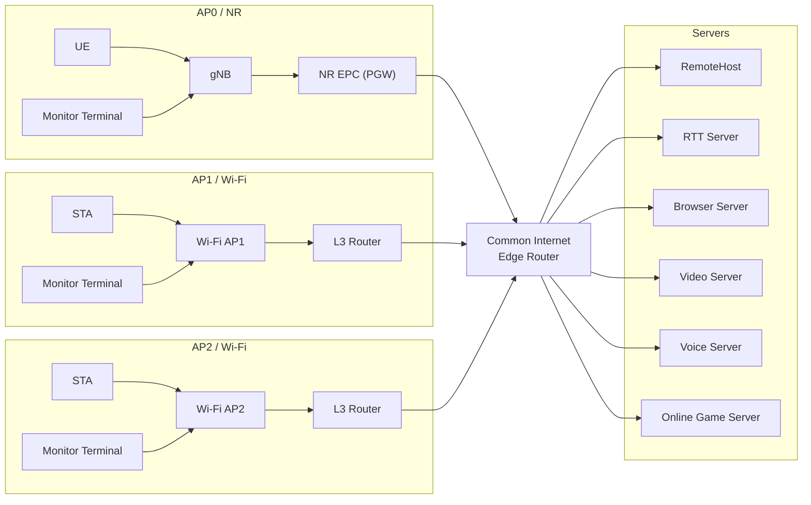

# 修士研究

## はじめに

このリポジトリは，ns-3上でヘテロジニアス無線ネットワーク環境を再現し，動的割り当て手法の有効性を検証するプロジェクトです．

- 目的: 動的割り当て手法の検証
- シナリオ: AP0が5G基地局，AP1/AP2がWi-Fi基地局，端末数は設定ファイルで変更可能
- 出力: スループットとラウンドトリップタイムを元に定義された端末満足度の調和平均（全体最適化の客観的評価）

## 目次
- [ネットワークアーキテクチャ](#ネットワークアーキテクチャ)
- [環境設定](#環境設定)
- [実行](#実行)
- [出力ログ](#出力ログ)
- [ディレクトリ構造](#ディレクトリ構造)
- [進捗状況](#進捗状況)
- [実験環境](#実験環境)

## ネットワークアーキテクチャ


```mermaid
flowchart LR
    %% --- Groups ---
    subgraph GNR["AP0 / NR"]
        NRUE["UE"]
        NRMON["Monitor Terminal"]
        gNB["gNB"]
        NREPC["NR EPC (PGW)"]
        NRUE --> gNB
        NRMON --> gNB
        gNB --> NREPC
    end

    subgraph GWiFi1["AP1 / Wi-Fi"]
        WIFI1STA["STA"]
        WIFI1MON["Monitor Terminal"]
        WIFI1AP["Wi-Fi AP1"]
        WIFI1R["L3 Router"]
        WIFI1STA --> WIFI1AP
        WIFI1MON --> WIFI1AP
        WIFI1AP --> WIFI1R
    end

    subgraph GWiFi2["AP2 / Wi-Fi"]
        WIFI2STA["STA"]
        WIFI2MON["Monitor Terminal"]
        WIFI2AP["Wi-Fi AP2"]
        WIFI2R["L3 Router"]
        WIFI2STA --> WIFI2AP
        WIFI2MON --> WIFI2AP
        WIFI2AP --> WIFI2R
    end

    subgraph Servers["Servers"]
        RH["RemoteHost"]
        RTT["RTT Server"]
        BRW["Browser Server"]
        VID["Video Server"]
        VOI["Voice Server"]
        GAM["Online Game Server"]
    end

    %% --- Core Edge ---
    CER["Common Internet<br/>Edge Router"]
    NREPC --> CER
    WIFI1R --> CER
    WIFI2R --> CER

    %% --- Fan-out to servers ---
    CER --> RH
    CER --> RTT
    CER --> BRW
    CER --> VID
    CER --> VOI
    CER --> GAM
```
### 各ノードの概要
| 種別 | 名称 | 役割 |
|---|---|---|
| NR | UE | AP0 配下の端末 |
| NR | Monitor Terminal | AP0 の RTT を測定する監視端末 |
| NR | gNB | AP0 に相当する NR 基地局 |
| NR | NR EPC (PGW) | NR コアネットワーク |
| Wi-Fi1 | STA | AP1 配下の Wi-Fi 接続端末 |
| Wi-Fi1 | Monitor Terminal | AP1 の RTT を測定する監視端末 |
| Wi-Fi1 | Wi-Fi AP1 | AP1 に相当する Wi-Fi 基地局 |
| Wi-Fi1 | L3 Router | Wi-Fi AP1 と CER を接続するルータ |
| Wi-Fi2 | STA | AP2 配下の Wi-Fi 接続端末 |
| Wi-Fi2 | Monitor Terminal | AP2 の RTT を測定する監視端末 |
| Wi-Fi2 | Wi-Fi AP2 | AP2 に相当する Wi-Fi 基地局 |
| Wi-Fi2 | L3 Router | Wi-Fi AP2 と CER を接続するルータ |
| コア | CER | 共通エッジルータ |
| サーバ | RemoteHost | AP 選択，端末満足度計算，割り当て結果生成 |
| サーバ | RTT Server | 監視端末の RTT 測定結果を RemoteHost へ転送 |
| サーバ | Browser/Video/Voice/Online Game | 各アプリケーションのトラフィック送受信 |


### ノード間接続
- UE/Monitor Terminal → gNB: NR Wireless
- STA/Monitor Terminal → Wi-Fi AP1: Wi-Fi Wireless
- STA/Monitor Terminal → Wi-Fi AP2: Wi-Fi Wireless
- gNB → NR EPC(PGW) → CER : PointToPoint
- Wi-Fi AP1 → L3 Router → CER : PointToPoint
- Wi-Fi AP2 → L3 Router → CER : PointToPoint
- CER ↔ servers : PointToPoint

## 環境設定
- LinuxベースのOS環境でプロジェクトを実行することができます．
### システムのアップデート
```
sudo apt update && sudo apt upgrade -y
```
### 依存ライブラリ設定
```
sudo apt install g++ python3 cmake ninja-build git gir1.2-goocanvas-2.0 python3-gi python3-gi-cairo python3-pygraphviz gir1.2-gtk-3.0 ipython3 tcpdump wireshark sqlite3 libsqlite3-dev qtbase5-dev qtchooser qt5-qmake qtbase5-dev-tools openmpi-bin openmpi-common openmpi-doc libopenmpi-dev doxygen graphviz imagemagick python3-sphinx dia imagemagick texlive dvipng latexmk texlive-extra-utils texlive-latex-extra texlive-font-utils libeigen3-dev gsl-bin libgsl-dev libgslcblas0 libxml2 libxml2-dev libgtk-3-dev lxc-utils lxc-templates vtun uml-utilities ebtables bridge-utils libxml2 libxml2-dev libboost-all-dev ccache python3-full python3-pip
```
- 参考URL：https://www.nsnam.com/2025/03/blog-post.html

### インストール
```
git clone https://github.com/Sota-Okochi/ns-3.44.git
```

## 実行

### Pythonバインディングのビルドを有効化
```
cd ~/ns-3.44
./ns3 configure --build-profile=optimized --enable-examples
```
- `./ns3 configure`でも有効化できますが，サンプルコードを実行することができません．
- `--build-profile=optimized`で，デバッグ機能をオフにし，実行時間を短縮します．
### ビルド  
```
./ns3 build
```

### プロジェクトの実行  
- `method` で AP 割り当て手法を指定します．
```
./ns3 run "master --method=random"
```
```
./ns3 run "master --method=multi_greedy"
```

- 現状，実行可能な手法は `no_switch`, `random`, `all5g`, `rulebase`, `greedy`, `multi_greedy`, `multi_offload`, `logistic` です．

#### 割り当て手法

| method | 概要 |
|---|---|
| `no_switch` | 初期接続先を維持し，切り替えを行わない |
| `random` | 各端末の接続先 AP をランダムに選択する |
| `all5g` | 全端末を AP0 / 5G 基地局へ割り当てる |
| `rulebase` | 端末満足度が0.5を下回る端末を他の基地局へ切り替える |
| `greedy` | 調和平均の推定改善量が最大となる 1 端末の切り替えを行う |
| `multi_greedy` | `greedy` を複数回繰り返し，1 サイクル内で複数端末の切り替えを行う |
| `multi_offload` | 混雑している AP から，満足度に余裕のある端末を他 AP へ逃がす |
| `logistic` | 学習済みロジスティック回帰モデルを用いて，各端末の接続先 AP を推定する |

### 設定ファイル
主な実験条件は `data/setting.json` に記述します．

| 項目 | 説明 |
|---|---|
| `baseStations` | 基地局数 |
| `terminals` | 端末数 |
| `rngSeed` | 乱数 seed（初期状態を変更） |
| `numCycles` | 測定・割り当てサイクル数 |
| `cycleTimeSec` | 1サイクルの長さ |
| `monitorStartSec` / `monitorStopSec` | RTT/TP 測定ウィンドウ |
| `browserNumRequests` | ブラウザ通信のリクエスト数 |
| `handoverGraceCycles` | ハンドオーバ後の猶予サイクル数 |


### 予備コマンド
#### クリーン
```
./ns3 clean
```
- このコマンドを実行すると，CMake設定とビルドによって生成された成果物が削除されます．
- 再度，[ここから](#pythonバインディングのビルドを有効化)実行してください．

## 出力ログ

実行結果は `OUTPUT/<端末数>/` 以下に保存されます．主要なログは `master_log` です．該当する端末数のディレクトリがない場合は自動作成されます．
ただし，DQN の学習データ・学習結果・モデルは `OUTPUT/` の掃除で誤削除しないように，`OUTPUT/` の外に保存します．

```text
episodes/dqn/transitions/  # DQN学習用 transition
episodes/dqn/actions/      # DQN推論結果 action CSV
results/dqn/               # DQN学習loss・metadata
models/dqn/checkpoints/    # DQNモデル checkpoint
```

### master_log

ファイル名規則:

```text
OUTPUT/<端末数>/<method>/master_log_<seed>_<YYYYMMDD_HHMMSS>.csv
```

例:

```text
OUTPUT/80/random/master_log_1_20260523_174000.csv
OUTPUT/80/multi_greedy/master_log_1_20260523_202742.csv
```

CSV の列:

| 列名 | 説明 |
|---|---|
| `seed` | 乱数 seed |
| `method` | 実行した割り当て手法 |
| `cycle_id` | 測定・割り当てサイクル番号 |
| `ue_id` | 端末番号 |
| `previous_bs_id` | 割り当て前の接続先基地局 ID |
| `current_bs_id` | 現在の接続先基地局 ID |
| `app_type` | アプリケーション種別番号 |
| `tp_mbps` | 測定されたスループット [Mbps] |
| `rtt_ms` | 測定された RTT [ms] |
| `satisfaction` | アプリ要求値に対する端末満足度 |
| `num_users_on_current_bs` | 現在接続している基地局上の端末数 |
| `harmonic_mean` | そのサイクルの端末満足度の調和平均 |
| `num_unsatisfied_users` | 不満足端末数 |
| `target_ue_flag` | DRL などで切り替え候補端末として選ばれた場合は `1` |
| `action_selected_bs_id` | 割り当て手法が選択した移動先基地局 ID |
| `switch_flag` | 実際に切り替えが発生した場合は `1` |
| `h_after_estimated` | 割り当て後に推定された調和平均 |
| `reward` | 主に DRL 用の報酬値 |
| `measurement_valid` | 測定値が有効なら `1`，無効なら `0` |


## ディレクトリ構造

```text
ns-3.44/
├── master/                        ns-3上で実験シナリオを構築・実行する中心プログラム
│   ├── main.cc                    エントリポイント
│   ├── NetSim.h                   シミュレーションで使うクラス，変数，関数の宣言ヘッダ
│   ├── config.cc                  setting.jsonの読み込みと初期条件の設定
│   ├── applications.cc            ブラウザ，動画，音声，ゲームなどの通信アプリの設定
│   ├── topology.cc                NR，Wi-Fi，ルータ，サーバ間のネットワーク構成の作成
│   ├── handover.cc                AP割り当て結果に基づくハンドオーバ処理の実行
│   ├── RttForwarderApp.cc         監視端末が取得したRTT結果を転送する処理
│   └── RttForwarderApp.h          RTT転送処理で使うクラスと関数の宣言
├── baseline_methods/              ロジスティック回帰の比較手法を作成・評価する環境
│   ├── main.py                    エントリポイント
│   ├── config/                    AP，アプリ，シミュレーション条件の設定ファイル
│   ├── data/                      学習用データ，学習済みモデル，評価結果の保存先
│   ├── scripts/                   教師データ生成，モデル学習，評価を行うスクリプト
│   └── simulation/                比較手法用シミュレーションの内部実装
├── data/                          ns-3実験で読み込む設定ファイル
│   ├── setting.json               端末数，サイクル数，乱数seedなどの基本実験条件
│   ├── Verbose_Jurassic.dat       映像通信のトラフィック生成に使う入力データ
│   └── YouTube1080p_2min.dat      YouTube動画通信のトラフィック生成に使う入力データ
├── OUTPUT/                        CSVログの保存先
├── doc/                           ネットワーク構成，割り当て方針，DRL設計などの設計資料
├── contrib/                       標準ns-3に追加して使用する外部・独自モジュール
│   ├── kameda/                    AP選択や関連処理で利用する追加機能（先行研究）
│   └── nr/                        5G NRネットワークを構築するための追加モジュール
├── src/                           ns-3本体が提供する標準モジュール群
├── CMakeLists.txt                 プロジェクト全体のビルド設定
├── ns3                            configure，build，runなどを実行する操作用スクリプト
├── VERSION                        使用しているns-3のバージョン情報
└── README.md                      本プロジェクトの概要，実行方法，構成の説明
```

## 進捗状況

| 状態 | 項目 |
|---|---|
| ✅ 完了 | 端末のアプリケーション設定 |
| ✅ 完了 | Wi-Fi基地局の設定 |
| ✅ 完了 | 端末満足度の調和平均の測定コード実装 |
| ✅ 完了 | pingによるRTT値取得コード実装 |
| ✅ 完了 | 各種アプリケーションサーバの構築 |
| ✅ 完了 | 5G基地局の実装 |
| ✅ 完了 | 端末の初期AP番号、アプリケーションのランダム設定 |
| ✅ 完了 | ランダム法による割り当て結果を元にハンドオーバ |
| ✅ 完了 | 連続に端末満足度の調和平均の計測 |
| ✅ 完了 | TPは各端末で取得 |
| ✅ 完了 | 各アプリケーションのデータ量を設定 |
| ✅ 完了 | 比較手法であるロジスティック回帰の実装完了 |
| ✅ 完了 | 深層強化学習ベースの手法の検討 |
| ▶️ 進行中 | 方策による経験データの収集（random, multi_greedy, rulebase, multi_offload） |
| ▶️ 進行中 | DQNの実装 |
| ⬜ 未着手 | 端末の移動の実装（実環境想定） |
| ⬜ 未着手 | 端末のアプリケーション変化（実環境想定） |


## 実験環境
- OS: Ubuntu 22.04 (WSL2)
- CPU: Intel Core Ultra 7 265KF
- GPU: NVIDIA Geforce RTX 5070
- Compiler: GCC 12.3.0
- CMake: 3.22.1
- ns-3: 3.44
