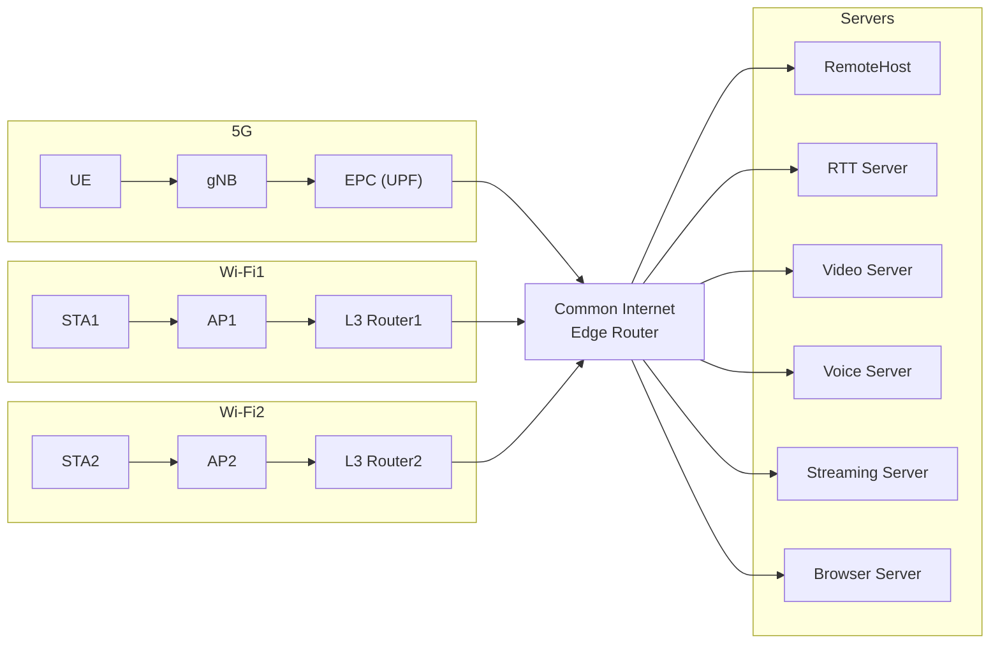

# 修士研究

## はじめに

このリポジトリは，ns-3上でヘテロジニアス無線ネットワーク環境を再現し，動的割り当て手法の有効性を検証するプロジェクトです．

- 目的: 動的割り当て手法の検証
- シナリオ: AP0が5G基地局，AP1,2はWi-Fi基地局，端末数は100台以上
- 出力: スループットとラウンドトリップタイムを元に定義された端末満足度の調和平均（全体最適化の客観的評価）

## 目次
- [ネットワークアーキテクチャ](#ネットワークアーキテクチャ)
- [環境設定](#環境設定)
- [実行](#実行)
- [ディレクトリ構造](#ディレクトリ構造)
- [実験環境](#実験環境)

## ネットワークアーキテクチャ


```mermaid
flowchart LR
    %% --- Groups ---
    subgraph G5G["5G"]
        UE[UE]
        gNB[gNB]
        EPC["EPC (UPF)"]
        UE --> gNB
        gNB --> EPC
    end

    subgraph GWiFi1["Wi-Fi1"]
        STA1[STA1]
        AP1[AP1]
        L3R1["L3 Router1"]
        STA1 --> AP1
        AP1 --> L3R1
    end

    subgraph GWiFi2["Wi-Fi2"]
        STA2[STA2]
        AP2[AP2]
        L3R2["L3 Router2"]
        STA2 --> AP2
        AP2 --> L3R2
    end

    subgraph Servers["Servers"]
        RH[RemoteHost]
        RTT["RTT Server"]
        VID["Video Server"]
        VOI["Voice Server"]
        STR["Streaming Server"]
        BRW["Browser Server"]
    end

    %% --- Core Edge ---
    CER["Common Internet<br/>Edge Router"]
    EPC --> CER
    L3R1 --> CER
    L3R2 --> CER

    %% --- Fan-out to servers ---
    CER --> RH
    CER --> RTT
    CER --> VID
    CER --> VOI
    CER --> STR
    CER --> BRW
```
### 各ノードの概要
| 種別 | 名称 | 役割 | 主な接続先 |
|---|---|---|---|
| 5G | UE | 端末 | gNB |
| 5G | gNB | 5G基地局 | UE / EPC |
| 5G | EPC (UPF) | 5Gコア | gNB / CER |
| Wi‑Fi1 | STA1 | 端末 | AP1 |
| Wi‑Fi1 | AP1 | Wi‑Fi AP | STA1 / L3 Router1 |
| Wi‑Fi1 | L3 Router1 | ルータ | AP1 / CER |
| Wi‑Fi2 | STA2 | 端末 | AP2 |
| Wi‑Fi2 | AP2 | Wi‑Fi AP | STA2 / L3 Router2 |
| Wi‑Fi2 | L3 Router2 | ルータ | AP2 / CER |
| コア | CER | 共通エッジルータ | EPC / L3R1 / L3R2 / 各サーバ |
| サーバ | RemoteHost | 動的割り当て手法の計算 | CER |
| サーバ | RTT Server | RTT計測 | CER |
| サーバ | Video/Voice/Streaming/Browser | 各アプリケーションの配信 | CER |


### ノード間接続
- UE→gNB, STA→AP: Wireless
- gNB → EPC(UPF) → CER : PointToPoint
- AP1 → L3R1[L3 Router1] → CER : PointToPoint 
- AP2 → L3R2[L3 Router2] → CER : PointToPoint 
- CER ↔ servers : PointToPoint

## 環境設定
- LinuxベースのOS環境でプロジェクトを実行することができます．
### システムのアップデート
```
sudo apt update && sudo apt upgrade -y
```
### 依存ライブラリ設定
```
sudo apt install g++ python3 cmake ninja-build git gir1.2-goocanvas-2.0 python3-gi python3-gi-cairo python3-pygraphviz gir1.2-gtk-3.0 ipython3 tcpdump wireshark sqlite3 libsqlite3-dev qtbase5-dev qtchooser qt5-qmake qtbase5-dev-tools openmpi-bin openmpi-common openmpi-doc libopenmpi-dev doxygen graphviz imagemagick python3-sphinx dia imagemagick texlive dvipng latexmk texlive-extra-utils texlive-latex-extra texlive-font-utils libeigen3-dev gsl-bin libgsl-dev libgslcblas0 libxml2 libxml2-dev libgtk-3-dev lxc-utils lxc-templates vtun uml-utilities ebtables bridge-utils libxml2 libxml2-dev libboost-all-dev ccache python3-full python3-pip
```
- 参考URL：https://www.nsnam.com/2025/03/blog-post.html

クローン
```
git clone https://github.com/Sota-Okochi/ns-3.44.git
```

## 実行

1) CMake 設定
```
cd ~/ns-3.44
./ns3 configure --enable-examples
```
- `./ns3 configure`でも設定できますが，サンプルコードを実行することができません．
2) ビルド  
```
./ns3 build
```

3) 実行  
```
./ns3 run master -- --nth=3
```

## ディレクトリ構造

- master/: 実験用メインプログラム
  - main.cc: 引数処理と起動
  - NetSim.h: NetSim クラス宣言とシミュレーション全体で共有する定数・構造体を定義
  - config.cc: 設定 JSON や端末配置ファイルを読み込み、AP/端末数・初期 RTT・アプリ利用種別を NetSim に反映
  - applications.cc: Kameda モジュールや監視端末、音声・映像アプリなどをノードへインストールしデータ収集を制御
  - topology.cc: 各ノード生成から Wi-Fi/NR/P2P デバイス設定、モビリティ、ルーティング設定までネットワークを構築
  - RttForwarderApp.cc/h: RTT 測定結果を UDP 受信→TCP 送信でリモートホストへ転送する専用 Application（再接続処理付き）
- data/: 入力データ（上記ファイルを配置）
- OUTPUT/: 実行時出力（RTT/PCAP など）
- src/: ns-3 本体モジュール
- contrib/: 外部モジュール


## 実験環境
- OS: Ubuntu 22.04 (WSL2)
- CPU: Intel Core Ultra 7 265KF
- GPU: NVIDIA Geforce RTX 5070
- Compiler: GCC 12.3.0
- CMake: 3.22.1
- ns-3: 3.44
