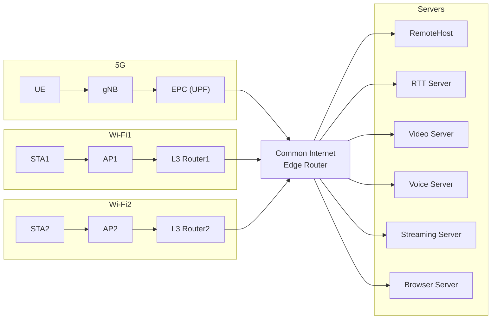

## Network Architecture

### Connection

- UE→gNB, STA→AP: Wireless
- gNB → EPC(UPF) → CER : PointToPoint
- AP1 → L3R1[L3 Router1] → CER : PointToPoint 
- AP2 → L3R2[L3 Router2] → CER : PointToPoint 
- CER ↔ servers : PointToPoint

## Specification

- 上記のネットワークアーキテクチャに構成を変更する。
- NetSim.cc/hで実装されているserver_rttの機能を分割する。
    - KamedaAppserverアプリをインストールは、新たにremoteHostを設置して追加（RTTデータの受け取りAP選択機能だけ）。
    - RTT計測は、そのままserver_rttにpingを送るようにする。
    - これにより server_rtt は RTT 計測専用サーバとして残し、AP 選択処理は RemoteHost が担当する。
    - APmonitor（検査用端末）が RTT データを送信し、RemoteHost は受信結果を一旦ターミナル出力する（端末へのフィードバックは今後の拡張）。
    - RTT 計測の送信主体は従来通り検査用端末のままとし、RemoteHost を経由しない。
    - 検査用端末は UE・STA と同じカテゴリの端末として扱い、取得した RTT 値を基地局やルータを介して RemoteHost へ送信する。既存実装がこの経路になっていない場合は修正する。
    - server_rtt は RTT 計測用サーバとして UDP で RTT データを受信し、RemoteHost への送信は損失検知のため TCP を用いる。
    - RemoteHost での AP 選択結果出力は NS_LOG を利用する。

## Constraints
- Browser ServerとStreaming Serverはまだ実装しない。
- RTT検査端末の処理や位置などは、変更しない。
- Browser Server と Streaming Server はダミーノードとして配置し、具体的な処理は本仕様の実装完了後に追加する。
